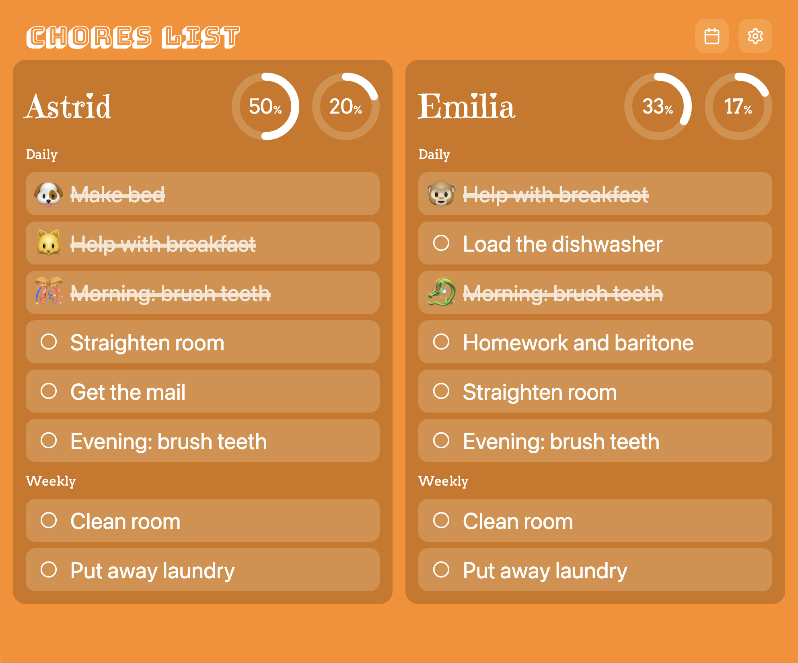

Made this chore tracking app for my kids entirely by vibe coding: Codex wrote all the code except the initial requirements file and this paragraph.

Chores App (Next.js + Supabase)

What’s included

- Next.js app with three screens: Home, Progress, Parent.
- Supabase schema and migrations in `supabase/migrations/0001_init.sql`.
- Simple app-wide password gate and parent PIN gate via cookies.
- PWA manifest and basic icon (SVG). Replace PNGs for iOS home screen.

Getting started

1. Copy `.env.example` to `.env.local` and fill Supabase URL and anon key. Adjust passwords.
2. Run the SQL in `supabase/migrations/0001_init.sql` in your Supabase project (SQL editor).
3. `npm install` then `npm run dev`.

Dev mode (no database)

- Set `NEXT_PUBLIC_DATA_MODE=local` in `.env.local` to use in-browser localStorage for chores, checkoffs, and settings. This is handy for local testing without Supabase. Switch back to `supabase` for shared data.

Notes

- iOS home screen requires PNG icons; add `public/icon-192.png` and `public/icon-512.png`. An SVG placeholder is provided as `public/icon.svg`.
- Daily resets at local midnight; weeks end Sunday night. Weekly percentage weights weekly chores x2.
- Errors writing to Supabase are surfaced inline on the UI.

Deployment

Supabase setup

- Create a new project at https://app.supabase.com/.
- In your project, open SQL editor and run the migration files in order:
  - `supabase/migrations/0001_init.sql`
  - `supabase/migrations/0002_add_emoji_to_checkoffs.sql` (persists the reward emoji with each completion)
  - Get your project URL and anon key from Project Settings → API.
  - No Row Level Security (RLS) required per requirements. Keep tables public for the app to read/write via anon key; access to the app is gated by the app password.

Local environment

- Copy `.env.example` → `.env.local` and set:
  - `NEXT_PUBLIC_SUPABASE_URL` and `NEXT_PUBLIC_SUPABASE_ANON_KEY`
  - `APP_GLOBAL_PASSWORD` and `APP_PARENT_PIN`
- For local testing without DB, set `NEXT_PUBLIC_DATA_MODE=local`. The app seeds sample data (chores and 8 weeks of completions) on first run to preview UI states.

Vercel deployment

1. Push this repository to GitHub/GitLab/Bitbucket.
2. In Vercel, “New Project” → import the repo.
3. Framework preset: Next.js. Build command: `next build`. Output: auto.
4. Environment variables (Project Settings → Environment Variables):
   - `APP_GLOBAL_PASSWORD`
   - `APP_PARENT_PIN`
   - `NEXT_PUBLIC_SUPABASE_URL`
   - `NEXT_PUBLIC_SUPABASE_ANON_KEY`
   - (optional) `NEXT_PUBLIC_DATA_MODE` (omit or set to `supabase` in production)
5. Deploy.

Post-deploy

- Visit your deployed URL. Enter the app password once (per device). Use the Parent PIN to access the editor.
- Add chores via the Parent screen (or rely on local seed data when using `local` mode).
- Add iOS home screen icons: provide `public/icon-192.png` and `public/icon-512.png` if you want platform PNGs in addition to the included SVG.
